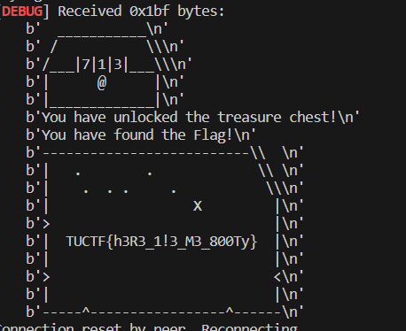

# Howdy, Everyone!
It's been a *really* long time since I made a post. This semester was pretty busy, but I'm finally ready to give a quick update.

## Things I Learned/Did
- Continued to work updating Sambot, my OpenAI Discord bot.
- Competed in NCL for the first time (I placed #243, hopefully I can improve that rank next year!)
- Played some CTFs with TAMU and friends. Recently, we won 3rd in TUCTF which was pretty cool. 🙂
- Explored Canarytokens, which I planned to write about but decided against it as they have amazing documentation already. In short, they are a quick and dirty (but very robust!) solution to intrusion detection which can be deployed in pretty much any application instantly.
## Life Updates
I finally got my first job in cyber (Yippee!) but I am still looking for a summer internship. Getting As in my classes has sapped up most of my free time, but I am excited to be back for winter break. Right now I am planning on learning some C++ and contributing to one or two web apps that I really enjoy.

## Random CTF writeup (Not Detailed)
As I mentioned earlier, ret2rev (TAMU) participated in TUCTF 2023 and placed 3rd. I didn't solve a lot of the challenges as we got carried (thanks, flocto) but I did solve this challenge involving using pwntools to crack a treasure chest.

The challenge was called "Bludgeon the Booty" and the goal is to rotate 3 wheels in order to crack the treasure chest.
I wrote a pwntools script that solved it via complete search, and this was my first time officially solving a CTF challenge with pwntools.
```python
from pwn import *
context.log_level = 'debug'
def connect_to_server():
    return remote("chal.tuctf.com", 30002)

max_reconnect_attempts = 100
reconnect_attempts = 0
hundreds = 0
tens = 0
ones = 0

while reconnect_attempts < max_reconnect_attempts:
    try:
        p = connect_to_server()
        while ones < 10:
            tens = 0
            while tens < 10:
                hundreds = 0
                while hundreds < 10:
                    p.recvuntil("Enter 1 to rotate the lock, or 2 to exit") # waits until after stuff
                    p.sendline(b"1")
                    p.recvuntil("Which wheel would you like to rotate? (1-3)")
                    p.sendline(b"1")
                    p.recvuntil("Which direction would you like to rotate the wheel? (+/-)")
                    p.sendline(b"+")
                    hundreds += 1
                    sleep(0.1)
                p.recvuntil("Enter 1 to rotate the lock, or 2 to exit") # waits until after stuff
                p.sendline(b"1")
                p.recvuntil("Which wheel would you like to rotate? (1-3)")
                p.sendline(b"2")
                p.recvuntil("Which direction would you like to rotate the wheel? (+/-)")
                p.sendline(b"+")
                sleep(.1)
                tens += 1
            p.recvuntil("Enter 1 to rotate the lock, or 2 to exit") # waits until after stuff
            p.sendline(b"1")
            p.recvuntil("Which wheel would you like to rotate? (1-3)")
            p.sendline(b"3")
            p.recvuntil("Which direction would you like to rotate the wheel? (+/-)")
            p.sendline(b"+")
            sleep(.1)
            ones += 1
    except (ConnectionResetError, EOFError):
        print("Connection reset by peer. Reconnecting...")
        p.close()  # Close the current connection
        reconnect_attempts += 1
        time.sleep(1)
    finally:
        pass
print("Womp Womp :(")
```
It's pretty clear how the script works so I won't take the time to explain it (plus this is mainly meant as a general update post!) but recvuntil was a new thing for me which was pretty cool. You may also notice the code attempts to reconnect and continue where it left off, which ended up not working as the combination on the chest resets when the connection is lost. In the end, I didn't get to solve this challenge as the TUCTF infrastructure was very unstable, and my school's WAF was also not super enthusiastic about my netcat connections so I kept getting reset. However, I asked a team member to run the script and they got the flag for me!

Goodbye for now!