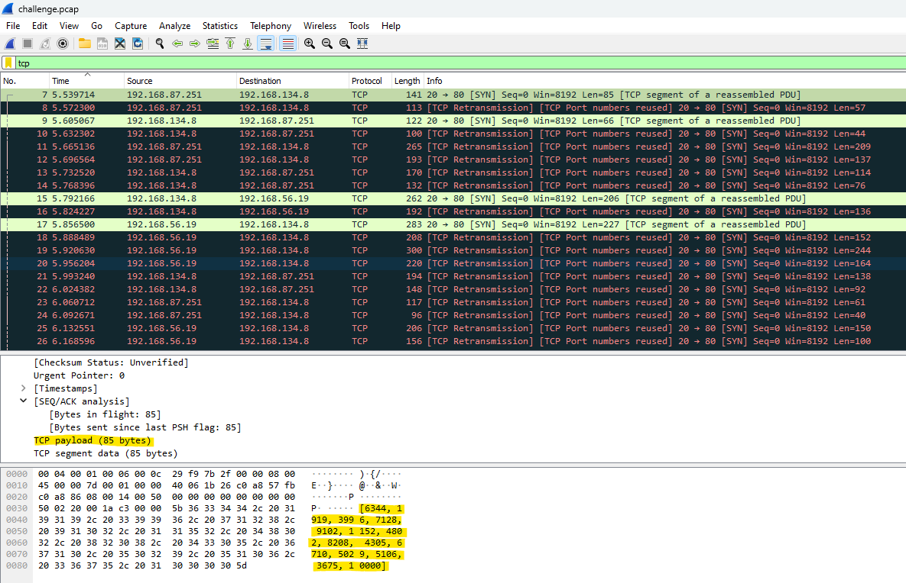

# Howdy, Everyone!
I'm back again for my semiannual blog post! Honestly, this website has never been much of a priority for me, but I recently did some cool stuff and I wanted to share it here.

## Things I Learned/Did
- played some ctfs
- grinded for a 4.0 GPA (I'm not keeping it LOL)
- summer hiking trip with friends
- got my GCIH certification
## Life Updates
I got an internship!!! I'm super grateful to have had the experience of working in Product Security (mainly AppSec) at Hitachi Energy this summer. I learned a lot about SSDLC and some of the specific tools that can be used to accomplish security at every gate of the software development process.

## corCTF 2024 - The Conspiracy

Since I haven't been posting writeups (or anything else as of recently) I think I'll make it a tradition to always include a writeup in blog updates from now on. So here is a pretty fun challenge I solved during corCTF. corCTF was honestly pretty difficult for me, and I spent most of the ctf looking for a nonexistent prototype pollution on a web challenge. However, this forensics challenge wasn't too challenging and was a lot of fun to solve.

### forensics/the-conspiracy
Author: jammy

```Our intelligence team created a chat app, and secretly distributed it to the lemonthinker gang. We've given you the application source and a capture taken by one of our agents - can you uncover their plans?```

We are given a `challenge.pcap` file, as well as a `source.py`

Let's take a look at the source code first:
``` python
import random
from scapy.all import *
import csv

sources, destinations, messages = [], [], []

with open('chatlogs.csv', mode='r') as file:
    csv_reader = csv.reader(file)
    for row in csv_reader:
        sources.append(row[0])
        destinations.append(row[1])
        messages.append(row[2])

def encrypt(message):
    messagenums = []
    for character in message:
        messagenums.append(ord(character))
    keys = []
    for i in range(len(messagenums)):
        keys.append(random.randint(10, 100))

    finalmessage = []
    for i in range(len(messagenums)):
        finalmessage.append(messagenums[i] * keys[i])

    return keys, finalmessage

for i in range(len(messages)):
    finalmessage, keys = encrypt(messages[i])
    print(finalmessage, keys)
    packet1 = IP(src=sources[i], dst=destinations[i])/TCP(dport=80)/Raw(load=str(finalmessage))
    send(packet1)
    packet2 = IP(src=sources[i], dst=destinations[i])/TCP(dport=80)/Raw(load=str(keys))
    send(packet2)
```

The code seems to be taking a csv containing chatlogs and encrypting them by generating a random number before multiplying the ASCII value of each character by that number. Luckily, two TCP packets are being sent out, with one containing the encrypted message and the other containing the list of keys used for each character in the message. The decryption is therefore very simple, as we just need to divide each character by the key it was encrypted with.

Investigating the tcp payloads inside of the packets in Wireshark, sure enough, it looks like our hypothesis about the source code is correct. The tcp payloads alternate lists of 2-digit numbers, and lists of 4-digit numbers (and the number 10000). The larger number represents the encrypted message, and the smaller numbers are the keys. Now we just have to extract these payloads and utilize the keys to decrypt the message.


Here's the python script I created to solve the challenge:

``` python
from scapy.all import rdpcap
import ast
# read pcap
packets = rdpcap('challenge.pcap')

tcp_data_segments = []
for packet in packets:
    if packet.haslayer('TCP') and packet['TCP'].payload:
        # extract tcp payload, parse it into a list of integers
        payload = ast.literal_eval(bytes(packet['TCP'].payload).decode('utf-8'))
        # append the list as a data segment
        tcp_data_segments.append(payload)

# parse alternating key,value lists and decode the secret message
for i in range(0, len(tcp_data_segments), 2):
    vals = tcp_data_segments[i]
    keys = tcp_data_segments[i + 1]
    decoded = ''.join(chr(vals[j] // keys[j]) for j in range(len(keys)))
    print("SEGMENT:", decoded)
```
After running it, I received the decrypted segments:
```
SEGMENT: hello blinkoid
SEGMENT: hello night
SEGMENT: how do we eliminate the msfroggers
[...]
SEGMENT: what's our code again?
SEGMENT: i think it's corctf{b@53d_af_f0r_th3_w1n}
```

I removed some of the output of the solve script to keep this post from getting too long, but there were a lot more decrypted segments showing a conversation. Anyway, this was my first time doing corCTF and while I feel like I was definitely in over my head, it was also really fun and a great learning experience. As always, thank you for reading and have a nice day!