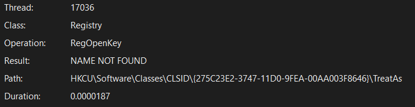
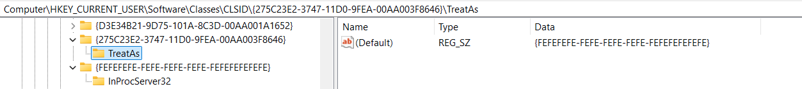
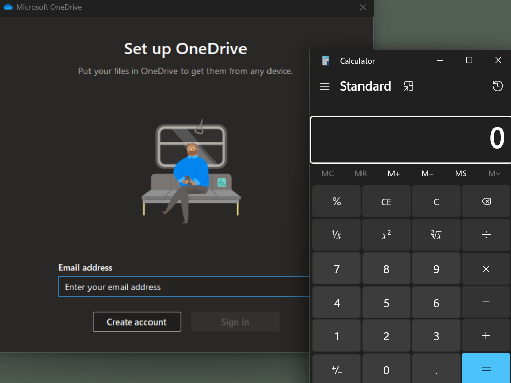
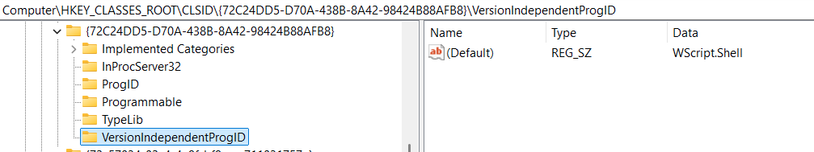
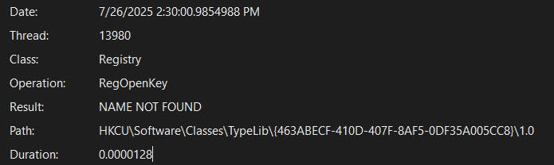
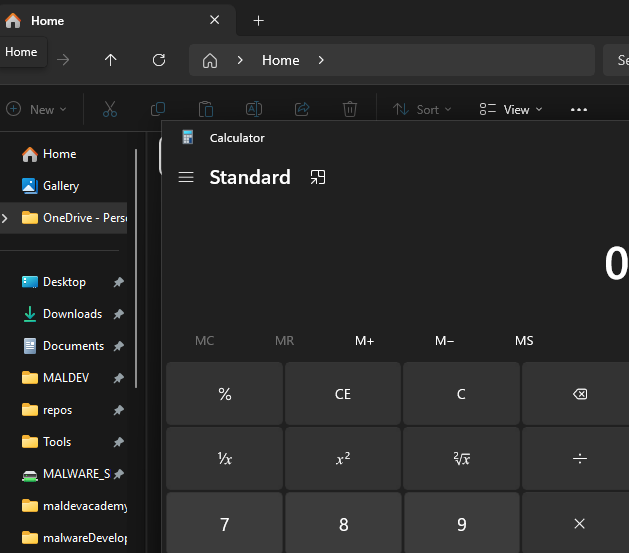

## Introduction
In part 1, we demonstrated a basic COM hijack by targeting a missing CLSID under `InProcServer32` to register a malicious DLL in the HKCU hive. The malicious DLL was created to spawn `calc.exe` in the `chrome.exe` process, while using DLL proxying to maintain functionality. In part 2, we will go over some alternatives to `InProcServer32` for stealthier hijacking, and potential detections and mitigations for [this technique](https://attack.mitre.org/techniques/T1546/015/). _Please note that this is not a comprehensive list, not all COM hijacking techniques will be covered!_

## Choosing a Target
This step was shown in Part 1 where we learned how to COM Hijack `InProcServer32`. This time around I chose `ondrive.exe` as my target. Just like last time, I was able to use InProcServer32 to hijack the `mlang.dll` COM Object in the HKCU hive to spawn calc. I won’t go over how I did this as it’s already covered in my previous article. Now let’s explore other methods to hijack the process:

## TreatAs
TreatAs allows a COM object with CLSID A to be treated as if it were another COM object with CLSID B. Essentially, it allows emulation of COM objects by specifying the CLSID of the object to emulate. It’s often used for backwards compatibility when an old application needs to interact with a newer COM object but expects an older CLSID. 

When inspecting onedrive in procmon, I noticed that it attempts to access a TreatAs entry under the missing COM Object. 

First, we register our own malicious COM object, giving it the relevant entries. Then, we create the missing CLSID key and give it a TreatAs entry, pointing to our malicious COM object.
Note that the 275C2* CLSID is that of the missing Object from onedrive, and FE* is that of my malicious COM object.

Just like before, we get calc to spawn. The benefit of using TreatAs is that we didn’t need to create or modify a `InProcServer32` value under the original COM object. Instead, we only needed to create the `TreatAs` entry in order to emulate the class using our malicious COM object. This can help to bypass some basic detections.

## AutoConvertTo
Similar to TreatAs, the AutoConvertTo entry allows you to call another CLSID, but is used specifically for object embedding / conversion. I unfortunately could not find a good target for this. This is a niche COM hijack, and I haven’t seen much information about it, but in theory it would be possible given the right conditions. If you are able to find a way to make this work, please contact me as I am curious!

## ProgID
A ProgID is basically a name associated with a CLSID. When a ProgID is associated with a COM object, the associated CLSID will be referenced. This example is based on [0xShukruN](https://www.221bluestreet.com/offensive-security/windows-components-object-model/com-hijacking-t1546.015#progid-hijacking)’s blog. The target for this hijack is Wscript, and we can see it has both a ProgID and InProcServer32.

We can observe both a `VersionIndependentProgID` and `ProgID`. Now we can create a malicious COM Object, and then remap the ProgID to our malicious CLSID. Here’s an example registry file with the relevant paths:
```
Windows Registry Editor Version 5.00

[HKEY_CURRENT_USER\SOFTWARE\Classes\WScript.Shell]
@="Windows Script Host Shell Object"

; add the malicious COM object here
[HKEY_CURRENT_USER\SOFTWARE\Classes\WScript.Shell\CLSID]
@="{FEFEFEFE-FEFE-FEFE-FEFE-FEFEFEFEFEFE}"

[HKEY_CURRENT_USER\SOFTWARE\Classes\WScript.Shell\CurVer]
@="WScript.Shell.1"

; evil COM object:
[HKEY_CURRENT_USER\SOFTWARE\Classes\CLSID\{FEFEFEFE-FEFE-FEFE-FEFE-FEFEFEFEFEFE}]
@=""

[HKEY_CURRENT_USER\SOFTWARE\Classes\CLSID\{FEFEFEFE-FEFE-FEFE-FEFE-FEFEFEFEFEFE}\InProcServer32]
@="comhijack.dll"
"ThreadingModel"="Apartment"

[HKEY_CURRENT_USER\SOFTWARE\Classes\CLSID\{FEFEFEFE-FEFE-FEFE-FEFE-FEFEFEFEFEFE}\ProgID]
@="WScript.Shell.1"

[HKEY_CURRENT_USER\SOFTWARE\Classes\CLSID\{FEFEFEFE-FEFE-FEFE-FEFE-FEFEFEFEFEFE}\VersionIndependentProgID]
@="WScript.Shell"
```
The most important thing here is noticing that we have registered our own COM object in `HKEY_CURRENT_USER\SOFTWARE\Classes\WScript.Shell\CLSID`.  Now, executing `New-Object -ComObject WScript.Shell` as a user in powershell, we should _in theory_ see calc spawn. I emphasize ‘in theory’ as this worked exactly once for me, and even after readding the keys, restarting my VM, trying different DLLs, etc, the object would simply crash instead of executing the code. I decided not to debug further since I theorize this is more to do with my hijack rather than the technique itself, which ShukRuN has showcased previously.

It’s also important to note that executing WScript.Shell via its own 72C24* CLSID will not result in the hijack, as we have only hijacked CLSID associated with the ProgID, not the CLSID of the object itself.

## TypeLib Hijacking
TypeLib hijacking isn’t a new technique, but it’s a relatively unknown one. TypeLib (Type Libraries) are binary files that contain documentation about objects, such as a module, interface, IDispatch interface (dispinterface), or component object class (coclass). The key to TypeLib hijacking is [monikers](https://learn.microsoft.com/en-us/windows/win32/com/monikers), which are objects that implement the [IMoniker](https://learn.microsoft.com/en-us/windows/desktop/api/ObjIdl/nn-objidl-imoniker) and function as a way to identify an object, typically implemented as COM objects. For TypeLib hijacking, the moniker of interest uses the ProgID ‘script’ which is for a Windows Script Component.

To hijack a TypeLib, the first step is identifying a target. To do so, we can use API Monitor and search for LoadTypeLib(Ex) calls, or use ProcMon to search for TypeLib keys that are missing from the HKCU hive.

I decided to use procmon and found the following target in chrome.exe:


We create an ASP XML scriptlet to launch our malicious application:
```xml
<?xml version="1.0"?>
<scriptlet>
    <Registration
        progid="typelibHijack"
        version="1.0">
    </Registration>
    <script language="JScript">
        <![CDATA[
            var WShell = new ActiveXObject("WScript.Shell");
            WShell.Run("calc.exe");
        ]]>
    </script>
</scriptlet>
```

Unfortunately, at this point I hit a dead end. It’s important to make sure that the CLSID of the TypeLib also has an InProcServer32 and actually loads a COM object and asks for type info. A [known example](https://cicada-8.medium.com/hijack-the-typelib-new-com-persistence-technique-32ae1d284661) is `{EAB22AC0-30C1-11CF-A7EB-0000C05BAE0B}` so I just used that.

We create the keys like so:
```
Windows Registry Editor Version 5.00

[HKEY_CURRENT_USER\SOFTWARE\Classes\TypeLib\{EAB22AC0-30C1-11CF-A7EB-0000C05BAE0B}]

[HKEY_CURRENT_USER\SOFTWARE\Classes\TypeLib\{EAB22AC0-30C1-11CF-A7EB-0000C05BAE0B}\1.1]
@="Microsoft Internet Controls"

[HKEY_CURRENT_USER\SOFTWARE\Classes\TypeLib\{EAB22AC0-30C1-11CF-A7EB-0000C05BAE0B}\1.1\0]

[HKEY_CURRENT_USER\SOFTWARE\Classes\TypeLib\{EAB22AC0-30C1-11CF-A7EB-0000C05BAE0B}\1.1\0\win32]
@="script:C:\\malicious.sct"

; Only really need the win64 entry since explorer.exe is typically 64 bit, win32 is optional
[HKEY_CURRENT_USER\SOFTWARE\Classes\TypeLib\{EAB22AC0-30C1-11CF-A7EB-0000C05BAE0B}\1.1\0\win64]
@="script:C:\\malicious.sct"

[HKEY_CURRENT_USER\SOFTWARE\Classes\TypeLib\{EAB22AC0-30C1-11CF-A7EB-0000C05BAE0B}\1.1\FLAGS]
@="0"

[HKEY_CURRENT_USER\SOFTWARE\Classes\TypeLib\{EAB22AC0-30C1-11CF-A7EB-0000C05BAE0B}\1.1\HELPDIR]
@="C:\\Windows\\System32"

```
**Fair warning** this will hijack Explorer.exe, which is a process that executes on startup. Always be cautious and make a backup of your VM if you are unsure of your interaction with the registry.

Our script will now execute whenever explorer.exe starts or stops.

## [DEPRECATED] Shell Service Object Delayed Load (SSODL)
To be forthright, this technique doesn’t appear to be in use on modern Windows (anything after XP.) Shell Service Object Delayed Load is a way for Explorer to automatically load components upon startup. WebCheck (CLSID: `{E6FB5E20-DE35-11CF-9C87-00AA005127ED}`) is an example that belongs to a the legitimate `webcheck.dll`. SSODL could historically be abused by registering a malicious COM object and adding its CLSID to `HKEY_LOCAL_MACHINE\SOFTWARE\Microsoft\Windows\CurrentVersion\ShellServiceObjectDelayLoad` but this doesn’t seem possible on modern Windows. My first thought was to hijack WebCheck itself and create a malicious proxy DLL for `webcheck.dll`, as we have seen in previous techniques. Upon further research, WebCheck appears to be a deprecated component for [Active Desktop](https://en.wikipedia.org/wiki/Active_Desktop). It's CLSID doesn’t exist and cannot be registered with `regsvr32`. This makes sense given that `explorer.exe` doesn’t appear to load the DLL on Windows 11, and in fact, no process loads it. The question remained of whether arbitrary CLSIDs will be loaded on startup if added, which didn’t seem to be the case when I tried it. I took a boot log with procmon and filtered for any registry activity relating to `ShellServiceObjectDelayLoad` which revealed no results out of 3.8 million events. Unfortunately I couldn’t find any Windows documentation about it, but it seems like `ShellServiceObjectDelayLoad` may not be in use anymore.
## Conclusion
In this article we examined COM Hijacking via TreatAs, AutoConvertTo, ProgID, TypeLib, and SSODL. These techniques all varied in complexity, scalability, level of persistence, and stealthiness. There are still a few more techniques that were not discussed in this article, such as a variation of TypeLib that can achieve fileless persistence via `Scriptlet URL`. I also was unable to exploit all of the techniques, with AutoConvertTo being the most difficult to find a target for. I think TypeLib is particularly exciting, as I’d consider stealthier than most traditional COM hijacks, and it seems like an incredibly powerful technique if used correctly. As always, please feel free to share thoughts / ideas if you have any!
## Cleanup:
Delete the relevant registry keys.

## References:
https://pentestlab.blog/2020/05/20/persistence-com-hijacking/
https://attack.mitre.org/techniques/T1546/015/
https://www.221bluestreet.com/offensive-security/windows-components-object-model/com-hijacking-t1546.015#progid-hijacking
https://cicada-8.medium.com/hijack-the-typelib-new-com-persistence-technique-32ae1d284661
https://www.outflank.nl/blog/2023/03/28/attacking-visual-studio-for-initial-access/