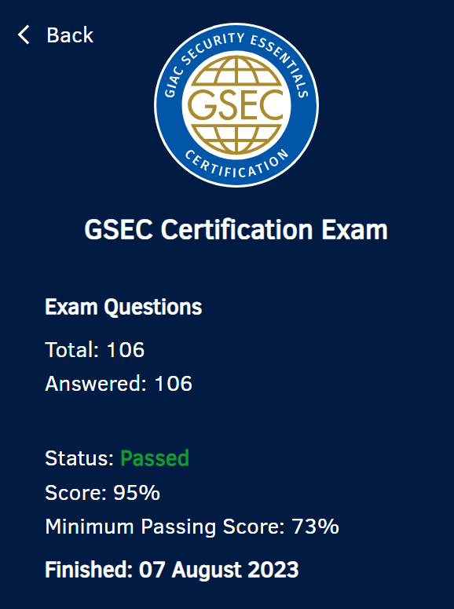

## Background Information
This summer I had planned to take the Sec+, but I was luckily given the chance to take the GIAC Security Essentials (GSEC) for free. From my experience with the GFACT, I was already familiar with the high-quality training and certifications that SANS provides, so I jumped at this opportunity.
## My Experience
I spent around 10 weeks from start to finish on the GSEC. The course was very broad in its content and covered pretty much everything I had studied in my Sec+ training, except having less emphasis on compliance standards (they are still mentioned, but aren't as much of a focal point as they seem to be in Sec+) besides this the GSEC seems to be more extensive than the Sec+, especially in areas such as cryptography, Azure AD, AWS, and Defense-in-Depth. Overall, I loved SEC401. The labs and instructor were both amazing, and I learned a lot.
## The Process
#### Plan Your Studying
I started by creating a study plan. I generally stuck to 1 module per day, as I planned to take 2-3 months for the certification, and I wanted to make sure I was actually internalizing the information. The amount you do per day will depend on how long you have to study for your exam, and how much time you want to dedicate per day to studying.
#### Find What Works for You
I chose to study by watching all the modules via OnDemand, and then reading through the books while creating my index. I chose to watch the videos as I had a lot of time, however, it's important to note that while anything in the book is fair game to be tested on, *not all the video content will be tested* as there are often anecdotes or additional information in the videos. I also did all of the labs as I did each module, as this made the most sense to me.
#### Pancake Time! (The indexing method, not the food)
Obligatory interjection that pancakes are my favorite food. They smell and taste super amazing, and it honestly doesn't even make sense how they are so good. With that out of the way, it's time to talk about the "Pancakes Index System" which isn't at all related to the food.

For pretty much any GIAC exam, a solid index is crucial to succeeding on the test. An index allows you to quickly and efficiently reference information in the books, which is pretty valuable given the SEC401 books' 1,500+ pages. I originally stumbled across Pancakes Index System when I was looking for a way to organize my index for the GSEC. Lesley Carhart does a great job explaining it [on her page](https://tisiphone.net/2015/08/18/giac-testing/) and I highly recommend reading her explanation, however, I will explain how I utilized the method.

The first step is acquiring the right materials. I needed **highlighters** (one color per book), **sticky tabs** (one color per section/module) and access to a **color printer**. Once I had everything, I started my index in Google Sheets (you can use whatever CSV editor you like.)

I formatted each entry ```Book#.Page#	| Term [Alphabetical Order]```
For example: 
I also chose the following color scheme for entries:
```
Book One: Red
Book Two: Orange
Book Three: Yellow
Book Four: Green
Book Five: Blue
Book Six: Purple
Lab Book: Black
---------------------
Module One: Red
Module Two: Orange
Module Three: Yellow
Module Four: Green
Module Five: Blue
Module Six: Pink
```
So, reading the above entry by color, I would see purple and look at book 6, and then see orange and flip to the orange tab that corresponds to the 2nd module within book 6.

For the actual process of indexing, I read through each book, tabbing and highlighting each module with the corresponding module color, coloring the front cover and edges of the book with the book color, and of course adding the entries into my spreadsheet as I go.

After I finished all of my entries, I sorted my index alphabetically, formatted it into 2 columns, and got it printed at the local UPS. This is something I would recommend you do *after* taking a practice test, however, I didn't think I would make many modifications to it, and it turned out to be mostly fine, although I ended up manually writing in a few more entries.

Once I was done, my books and index looked like this:
I decided to donate my 2nd practice test, as I was confident enough that I could do well on the real thing, so I booked an in-person test and took my exam!
## Final Thoughts
The GSEC was a highly educational experience for me, and I enjoyed the class and the certification. Learning the "Pancake Method" of indexing was highly beneficial, and helped me keep an organized index for the exam. In the future, I hope to take more GIAC tests, especially the GCIH. Good luck to those taking GIAC tests, and happy pancaking!