## IoCs / Detection
Here are a few potential indicators that your device was infected with this specific Vidar Stealer sample:

Hashes:<br></br>
MD5:    `1e93a4d0cd65882a41e0bd386c86e591`<br></br>
SHA1:   `2757f19ac627f55ebd50184f68f1c9c0b7714798`<br></br>
SHA256: `d4b1c7d67b8b6d7fc996a4196990731605aa182f8ed4897b1d73088dcc63f606`<br></br>

Strings (found when unpacked):<br></br>
`C:\ProgramData\`<br></br>
`%LOCALAPPDATA%`<br></br>
`%PROGRAMDATA%`<br></br>
`HostName`<br></br>
`UserName`<br></br>
`Password`<br></br>
`PortNumber`<br></br>
`%s:%d`<br></br>
`%s:%lu`<br></br>
`%s\%s:send`<br></br>

Network Connections:<br></br>
`https[:]steamcommunity[.]com/profiles/76561198714231957`<br></br>
`https[:]telegram[.]me/ci0iiif`<br></br>

Registry Keys:<br></br>
`HKCU\Software\Microsoft\Windows\CurrentVersion\Internet Settings\ZoneMap\ProxyBypass`<br></br>
`HKCU\Software\Microsoft\Windows\CurrentVersion\Internet Settings\ZoneMap\IntranetName`<br></br>
`HKCU\Software\Microsoft\Windows\CurrentVersion\Internet Settings\ZoneMap\UNCAsIntranet`<br></br>
`HKCU\Software\Microsoft\Windows\CurrentVersion\Internet Settings\ZoneMap\AutoDetect`<br></br>
`HKLM\Software\Microsoft\Windows\CurrentVersion\Internet Settings\Zones`<br></br>
`HKLM\Software\Policies\Microsoft\Windows\CurrentVersion\Internet Settings\Lockdown_Zones`<br></br>

## Summary
I wanted to learn more about reverse engineering, so I chose to analyze a sample of the Vidar Stealer infostealer I found here: https://tria.ge/260423-kt1xfsfw41. The sample wasn't chosen for any particular reason besides the fact that it was tagged as an infostealer, and I thought it would be an interesting piece of malware to look at. The goal of this was to exercise my malware analysis skills while learning more about reverse engineering. This article serves more as a document of my process and what I learned rather than a full breakdown of Vidar.

The sample is a 64-bit PE32 infostealer malware, which appears to be UPX packed. In the following article I will perform some static and dynamic analysis to learn more about its capabilities, how it works, and what can be done to detect and remove it.

## Unpacking
In the age of Ghidra, I decided to use Binary Ninja to start analyzing the malware. Viewing it in Binary Ninja, I noticed UPX1 and UPX2 sections, meaning the malware needs to be unpacked before continuing.

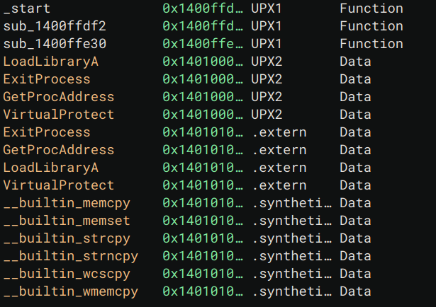

## Strings of Interest
Viewing the strings in the binary, I was lucky enough that they weren't all encrypted / obfuscated.

I already knew this was a stealer since on the tria.ge page it was categorized as such, but I took a stab at what this malware may be doing based on the following strings:

The following strings likely indicate it utilizing browser plugins. Maybe it is exfiltrating browser data?
- chromium_plugins
- moz-extension+++

Oops, I just found `\Network\Cookies` so yes, we can confidently guess that the malware is stealing browser cookies.
`\Network\Cookies` would be part of a larger path that most major browsers (Edge, Chrome) would store browser cookies in on a Windows device.


These strings indicate paths that it could be utilizing for persistence or data exfiltration.
- C:\ProgramData\
- %LOCALAPPDATA%
- %PROGRAMDATA%
- %TEMP%
- !!!!!!!!!!!!!!!!!!!!!!!!!!!!!!!!!!!!!!!!!!!!!!!!!!!!!!!!!!%DESKTOP%

These strings could be used to set `BCRYPT_CHAINING_MODE` indicating the use of BCrypt, likely to hash a password since we have a string for that too.
- ChainingModeGCM
- ChainingMode

GetSystemMetrics is used to get information about a system, primarily display elements.
- uuuuuuuuuuuuuuuuGetSystemMetrics

These strings seem very significant. This could either be credentials that the attacker is using, or more likely, settings / data pertaining to the victim endpoint that can be sent back to the attacker.
- HostName
- UserName
- Password
- PortNumber

These strings indicate printf, there is likely some formatted data being printed out.
- %08lX%04lX%08lX
- %s:%d
- %s:%lu
- %s\%s:send

## Imported Methods
After unpacking, we unfortunately still don't see any Windows APIs being called. Instead there are hundreds of random functions in main. If I had to guess, the malware uses some sort of dynamic resolution to locate DLLs and SSNs (basically syscall numbers for Windows) The only issue with this theory is that usually you wouldn't still need `GetModuleHandleA` and `GetProcAddress` or to implement your own versions of these functions for address resolution. As shown in CFF explorer, there's literally nothing...
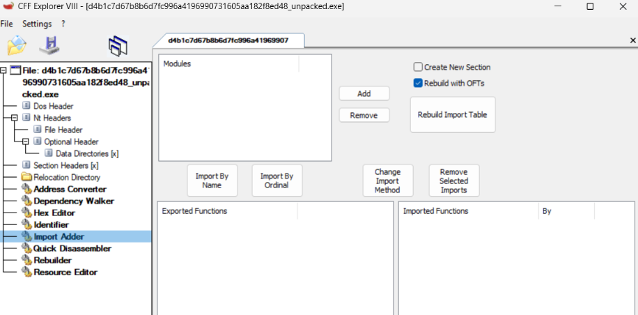

At this point I decided to move on since I can always figure out how functions are being resolved later, or just do some dynamic analysis.

## Decompilation Analysis
Starting at `_start` in Binary Ninja, I quickly realized that this wasn't the typical PE32 initialization code. The code appears to be heavily obfuscated with lots of junk code and unreachable functions. For instance near the top of the function, we see:

```c
14000eb95        if (data_1400fb3d4 >= 0xa)
14000eb95        {
14000eb97            int32_t rax_1 = data_1400fb3d0;
14000eb97            
14000eba6            if (((rax_1 + 1) * rax_1) & 1)
14000eba6            {
14000eba8                while (true)
14000eba8                    /* nop */
14000eba6            }
14000eb95        }
```
This code effectively does nothing. The while loop is unreachable since you're multiplying consecutive numbers, meaning it will always be an even number ANDed with 1, which will of course be 0 or false.

Likewise we see the following later in the function:
```c
14000ebc1            rsp_2 = (char*)rsp - do_nothing();
14000ebd1            rsp_3 = (char*)rsp_2 - do_nothing();
```
I decided to call this function `do_nothing` as it follows similar logic to the code shown above, and it's called constantly but provides no clear value.

Taking a look at `do_nothing` we see:
```c
140082546    void do_nothing()

140082546    {
140082546        if (data_1400fb3ac < 0xa)
14008254d            return;
14008254d        
14008254f        int32_t rax = data_1400fb3a8;
14008254f        
14008255e        if (!(((rax + 1) * rax) & 1))
14008255e            return;
14008255e        
140082560        while (true)
140082560            /* nop */
140082546    }
```
It always returns, we can treat this as a no-op.

Escaping from main, I decided to take a look at the function that uses the strings "Hostname", "Username", "Password", etc.
Like the other functions, it is incredibly obfuscated and long so I won't share the entire decompiled function here.

Things start to get interesting in the following while loop:
```c
1400564a9   while (true)
1400564a9   {
1400564a9       sub_140082420(r13_2, 0, 0x200);
1400564bd       sub_140082420(rsp_9, 0, 0x200);
1400564d1       sub_140082420(rsp_10, 0, 0x800);
1400564de       *(uint32_t*)rsp_11 = 0x16;
1400564e9       *(uint32_t*)r14_1 = 0x200;
1400564ec       *(uint64_t*)rbx_2;
1400564f3       *(uint64_t*)((char*)rsp_42 - 0x10) = r14_1;
1400564f8       *(uint64_t*)((char*)rsp_42 - 0x18) = r13_2;
140056500       *(uint64_t*)((char*)rsp_42 - 0x20) = 0;
140056515       data_1400c9ea8(/* nop */);
140056524       *(uint32_t*)r14_1 = 0x200;
140056527       *(uint64_t*)rbx_2;
14005652e       *(uint64_t*)((char*)rsp_42 - 0x10) = r14_1;
140056533       *(uint64_t*)((char*)rsp_42 - 0x18) = rsp_9;
140056538       *(uint64_t*)((char*)rsp_42 - 0x20) = 0;
14005654d       data_1400c9ea8(/* nop */);
140056557       *(uint32_t*)r14_1 = 0x800;
14005655e       *(uint64_t*)rbx_2;
140056565       *(uint64_t*)((char*)rsp_42 - 0x10) = r14_1;
14005656a       *(uint64_t*)((char*)rsp_42 - 0x18) = rsp_10;
14005656f       *(uint64_t*)((char*)rsp_42 - 0x20) = 0;
140056584       data_1400c9ea8(/* nop */);
14005658e       *(uint32_t*)r14_1 = 4;
140056595       *(uint64_t*)rbx_2;
14005659c       *(uint64_t*)((char*)rsp_42 - 0x10) = r14_1;
1400565a5       *(uint64_t*)((char*)rsp_42 - 0x18) = rsp_11;
1400565aa       *(uint64_t*)((char*)rsp_42 - 0x20) = 0;
1400565bf       data_1400c9ea8(/* nop */);
...
```

The top part has arguments that look like memset, I decided to explore it:
```c
140082420    char* obfuscated_memset(char* arg1, char arg2, int64_t arg3)

140082420    {
140082420        if (data_1400fb3d4 >= 0xa)
140082427        {
140082429            int32_t rax_1 = data_1400fb3d0;
140082429            
14008243b            if (((rax_1 + 1) * rax_1) & 1)
14008243b            {
14008243d                while (true)
14008243d                    /* nop */
14008243b            }
140082427        }
140082427        
14008243f        int64_t rax_2 = 0;
14008243f        
140082444        while (true)
140082444        {
140082444            if (rax_2 == arg3)
140082487                return arg1;
140082487            
140082469            int32_t r9_4;
140082469            int32_t r10_1;
140082469            
140082469            do
140082469            {
140082446                arg1[rax_2] = arg2;
140082449                r9_4 = data_1400fb3d0;
140082450                r10_1 = data_1400fb3d4;
140082450                
14008245b                if (r10_1 < 0xa)
14008245b                    break;
140082469            } while (((r9_4 + 1) * r9_4) & 1);
140082469            
14008246b            rax_2 += 1;
14008246b            
140082472            if (r10_1 >= 0xa)
140082472            {
140082480                if (((r9_4 + 1) * r9_4) & 1)
140082480                    break;
140082472            }
140082444        }
140082444        
140082482        while (true)
140082482            /* nop */
140082420    }
```
There's a lot going on here, but it became less scary once I realized that the vast majority of this code is the deadcode that I have already seen so many times in other functions.

Here's what the code looks like with cleaned up variable names, the parts that actually comprise the memset are highlighted green:

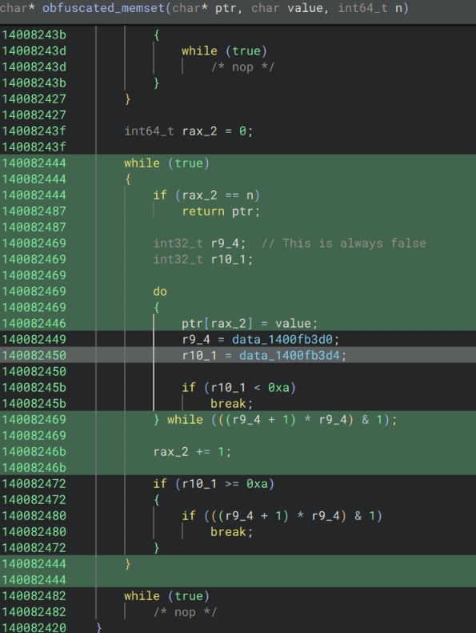

```c
140082444    while (true)
140082444    {
140082444        if (rax_2 == n)
140082487            return ptr;
140082469        do
140082469        {
140082446            ptr[rax_2] = value;
140082469        } while (false);
14008246b        rax_2 += 1;
140082444    }

// so rewriting this function, we would get something like:
char* deobfuscated_memset(char* ptr, char value, int64_t n){
    for(int64_t i = 0; i < n; i++){
        ptr[i] = value;
    }
    return ptr;
}
```

Unfortunately there is still the question of what is happening with the strings.

The calls showing up like `data_1400c9ea8(/* nop */);` indicates that these are indirect calls, meaning the address is resolved and placed in data where it can be called as a function pointer.

Investigating the disassembly we see:
```c
1400564ec  488b0b             mov     rcx, qword [rbx]
1400564ef  4883ec40           sub     rsp, 0x40
1400564f3  4c89742430         mov     qword [rsp+0x30], r14
1400564f8  4c896c2428         mov     qword [rsp+0x28], r13
1400564fd  4531ed             xor     r13d, r13d  {0x0}
140056500  4c896c2420         mov     qword [rsp+0x20], r13  {0x0}
140056505  4c89e2             mov     rdx, r12
140056508  4c8d05370bfbff     lea     r8, [rel data_140007046]  {u"HostName"}
14005650f  41b902000000       mov     r9d, 0x2
140056515  ff158d390700       call    qword [rel data_1400c9ea8]
```
While I am not proficient enough to confidently say what this does, `call    qword [rel data_1400c9ea8]` indicates we are fetching an 8 byte (quad word) function pointer from `data_1400c9ea8` and jumping to it. This isn't an indirect syscall but it is an indirect call, which likely explains which explains why earlier there weren't any imports.

This got me interested in figuring out how exactly the malware is resolving these function pointers. To figure it out, I searched the symbols for `data_1400c9ea8` to see where it gets written to, as this is eventually used as a function pointer with the "HostName" argument.

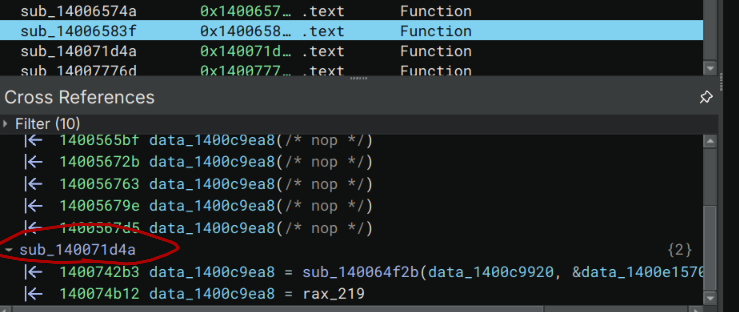

There's a mysterious function called `sub_140071d4a` that seems to assign that location twice.

Taking a closer look, I noticed some suspicious bytes being copied and XORd:

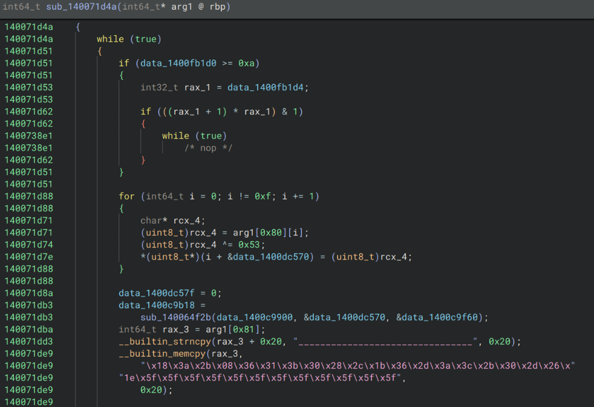
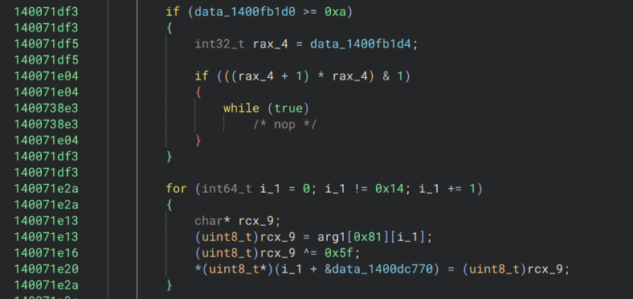

Following the logic, a lot of it can be cleaned up / ignored, but it appears that some bytes are being copied to `arg1`, then in this case they're XORed with 0x5f.

When I saw this I was very suspicious that a function pointer would be assigned by a function that takes what appears to be gibberish bytes, XORs it, calls another mysterious function, then writes the results to .data. This looks a lot like XOR encrypted API names that are being resolved.

Any easy way to test this is to try to manually XOR the bytes:
```py
hex_list = [
    0x18, 0x3a, 0x2b, 0x08, 0x36, 0x31, 0x3b, 0x30, 0x28, 0x2c, 0x1b, 0x36, 0x2d, 0x3a, 0x3c, 0x2b,
    0x30, 0x2d, 0x26, 0x1e, 0x5f, 0x5f, 0x5f, 0x5f, 0x5f, 0x5f, 0x5f, 0x5f, 0x5f, 0x5f, 0x5f, 0x5f
]
byte_data = bytes(hex_list)
key = 0x5f
encoded = bytes([b ^ key for b in byte_data])
print(encoded.decode('utf-8'))
```
And the result is `GetWindowsDirectoryA`

After this string resolution happens, the following occurs:
```c
140071e55            data_1400c9b20 =
140071e55                sub_140064f2b(data_1400c9900, &data_1400dc770, &data_1400c9f60);
```
Based off of where in data the result is being assigned and the things that are being passed in, this is very likely a custom version of `GetProcAddress` used for dynamic function resolution to map the indirect calls. This could also be the reason why there were no signs of `GetProcAddress` earlier in CFF explorer. No need for imports when you can simply map out functions manually in memory, and then use indirect calls once you have the locations of the functions you need!

I know I haven't proven without a doubt that `sub_140064f2b` is a custom GetProcAddress, but the function is absolutely massive and a complete garbled mess and I didn't have the mental capacity to work on that at the time. However a few things that I noticed which heavily suggest that it works similar to how I described are 1. the first and last arguments tend to be consistent among all of the calls for function resolution, this likely implies one of them is the library name (ntdll, kernel32, etc) and I'm honestly not quite sure what the other one is. Additionally, the middle argument is always the resolved function name, and `sub_140064f2b` references the string `.dll` which is likely it searching for the correct DLL to attempt the resolve the function address.

If I had more time I would've went deeper into this but it was still good to have my answer to why the IAT was so empty, and how the functions are being resolved. (indirect function calls using a custom GetProcAddress and XOR encrypted strings)

After figuring this all out I wanted to go back the very beginning where I was looking at "HostName" and the `data_1400c9ea8` call. 

Unfortunately, things look a little different this time:
```c
1400741ea    data_1400e1384 = 0;
140074213    data_1400c9ea0 = sub_140064f2b(data_1400c9920, 
140074213        &data_1400e1370, &data_1400c9f60);
14007423f    __builtin_memset(&rsp_169[0x10], 0xfd, 0x30);
14007424a    *(uint128_t*)rsp_169 = data_14000b970;
14007424a    
140074254    if (data_1400fb1d0 >= 0xa)
140074254    {
140074256        int32_t rax_1429 = data_1400fb1d4;
140074256        
140074265        if (((rax_1429 + 1) * rax_1429) & 1)
140074265        {
140074c0a            while (true)
140074c0a                /* nop */
140074265        }
140074254    }
140074254    
140074288    for (int64_t i_284 = 0; i_284 != 0xc; i_284 += 1)
140074288    {
140074278        char* rdx_188;
140074278        (uint8_t)rdx_188 = rsp_169[i_284];
14007427b        (uint8_t)rdx_188 ^= 0xfd;
14007427e        *(uint8_t*)(i_284 + &data_1400e1570) =
14007427e            (uint8_t)rdx_188;
140074288    }
140074288    
14007428a    data_1400e157c = 0;
1400742b3    mysterious_hostname_call = sub_140064f2b(
1400742b3        data_1400c9920, &data_1400e1570, &data_1400c9f60);
1400742e0    __builtin_memset(&rsp_170[0x10], 3, 0x30);
1400742ed    *(uint128_t*)rsp_170 = data_14000b9b0;
```

Also, `mysterious_hostname_call` is `data_1400c9ea8`
Instead of the regular __builtin_memcpy I saw earlier, I just had `14007424a                                    *(uint128_t*)rsp_169 = data_14000b970;`
I think this is just Binary Ninja being funny because `data_14000b970` is small. In fact, it contains `\xaf\x98\x9a\xba\x98\x89\xab\x9c\x91\x88\x98\xaa\xfd\xfd\xfd\xfd` and 0xfd is the key for this xor decryption as shown in the decompilation, so those are just null bytes.

Using the same python script from earlier, it turned out that the mysterious function that has "HostName" passed in was `RegGetValueW`.

At this point I finally had a decent idea of what this function is doing.

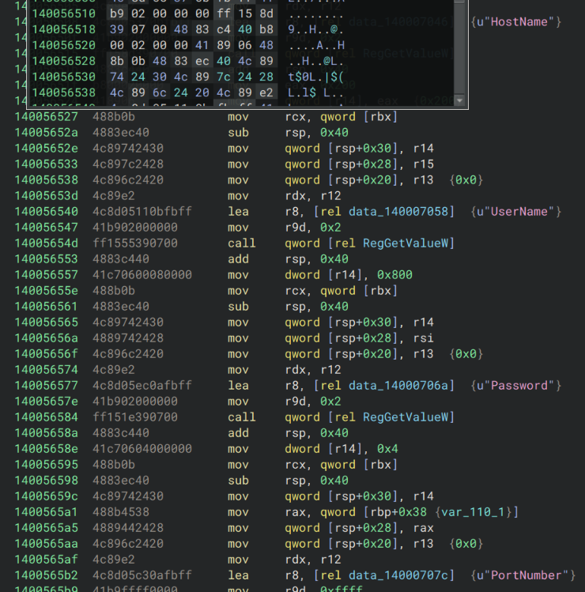

It appears to read the registry values of "HostName", "UserName", "Password", "PortNumber". It's likely collecting this information from the registry to send to the attacker.

If I had had more time, I would have gone further by decrypting all of the Windows functions, but I decided this was enough to start trying some other types of analysis.

So far from the static analysis, I was able to figure out that it queries some registry keys, likely touches files in a few specific paths, resolves DLLs at runtime with indirect function calls, and likely does some sort of browser cookie exfiltration.

## Network Analysis
I chose to run the unpacked version of the malware, and curiously enough, it gave me a warning telling me that the malware should be packed before distribution, which I thought was funny.

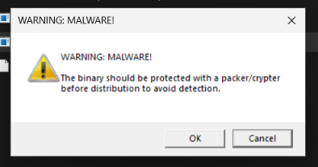

For the rest of the network analysis, I used the packed version as I wanted to ensure I was analyzing an untampered version.

There are two domains in particular that I noted a lot of HTTPS requests being sent to:
```
2026-04-25 19:52:10  HTTPS connection, method: GET, URL: https[:]//telegram[.]me/ci0iiif, file name: /var/lib/inetsim/http/fakefiles/sample.html
2026-04-25 19:52:10  HTTPS connection, method: GET, URL: https[:]//steamcommunity[.]com/profiles/76561198714231957, file name: /var/lib/inetsim/http/fakefiles/sample.html
```

I investigated the URLs further and noted that the first one appears to be a steam account.

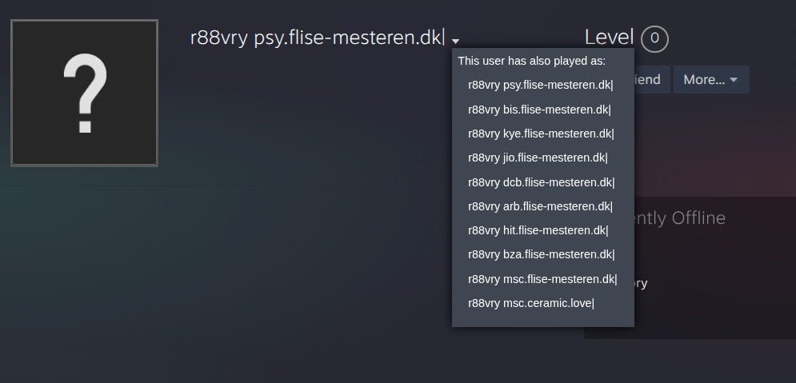

Looking at the previous names, they seem to all follow the pattern of "*abc*.flise-mesteren[.]dk|"

The telegram channel appears similarly:


Both share the `r88vry` name, and the telegram mentions a domain with the pattern "*abc*.dutraloc.com[.]br|"

Unfortunately for us, after making these initial GET requests, the malware exited silently. While it's possible that it properly executed and exfiltrated the browser data, I think it's more likely the GET requests to the telegram and steam pages are used to drop more malware, or provide some type of configuration.

My guess is that the first 3 letters are something arbitrarily chosen by the operator of the malware, and the domains that are present on the telegram/steam pages seem to be legitimate domains that were probably compromised to be used for the campaign at some point.

Since it seems the malware is no longer part of an active campaign, I wasn't able to evaluate any further network activity past these requests, but it does serve as an IoC that could be used for building detections.

## ProcMon Analysis (Registry & Files)
Analyzing the malware with ProcMon I noted the following:

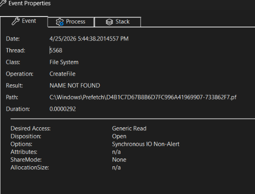

First it establishes a Windows Prefetch file, which I thought was a malicious thing but apparently is just used to speed up launch times and keep note that the file has executed.

Looking at the process tree, it doesn't seem to spawn any processes under it which is curious.

I filtered for `RegSetValue` and there are also no results, meaning the malware didn't create any new registry keys.

Looking at `CreateFile` I noticed several DLLs of interest being opened:
- wininet.dll: crucial for interacting with network, this makes sense since the stealer needs to send data using some protocol to the attacker
- bcrypt.dll: I already expected this from the static analysis, as there are strings heavily implying bcrypt. It's used for hashing
- cryptbase.dll: provides basic cryptographic protocols, could be used for HTTPS or other things.

What really confused me at this point was not finding Advapi32.dll. Usually you would need Advapi32.dll for the registry operations such as RegGetValue which were found in the decompilation. I'm not sure if I just missed it or the malware self-terminated before getting to that part.

Ok, actually searching some more I was able to find a Load Image operation, which told me that indeed advapi32.dll is being used which lines up with the static analysis.

Overall I wasn't able to find evidence of any persistence. I guess given that this is mainly an info stealer, that kind of makes sense since the point is primarily to exfiltrate sensitive information. 

Looking back at this, I believe the mistake I made was running the unpacked version. Running the untampered packed malware, I verified everything I found before, and there still doesn't seem to be much persistence but I did notice a few things when querying for `RegSetValue`:

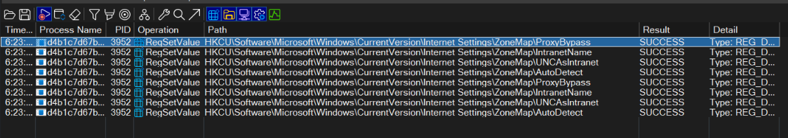

`HKCU\Software\Microsoft\Windows\CurrentVersion\Internet Settings\ZoneMap\ProxyBypass` is set to 1, lowering the security and allowing malicious traffic to get through.
`HKCU\Software\Microsoft\Windows\CurrentVersion\Internet Settings\ZoneMap\IntranetName` is set to 1, enabling single label hostnames for the intranet zone with similar security implications.
`HKCU\Software\Microsoft\Windows\CurrentVersion\Internet Settings\ZoneMap\UNCAsIntranet` is set to 1, which allows UNC paths into the intranet zone.
Lastly, `HKCU\Software\Microsoft\Windows\CurrentVersion\Internet Settings\ZoneMap\AutoDetect` set to 0, which disables "automatically detect settings" in Internet Explorer, weakening browser security settings.

All of these together point to weakening browser and Windows settings, implicating data exfiltration and a browser based attack.

## Debugger Analysis
To do some debugger analysis, I chose to focus on `NTSetValueKey` which is the native api (syscall) for `RegSetValueEx`. The reason I focused on this is because earlier I saw in ProcMon that certain registry strings were being changed, debugging this kernel call should allow us to confirm and see exactly whats happening under the hood.

I started by opening the malware in x64dbg and hitting "alt+f9" to run until user code. Then I went to symbols, selected ntdll.dll and searched for `NTSetValueKey`, and set a breakpoint on it. I then continued running the debugger until I hit the breakpoint.

After hitting the breakpoint, I continued until I hit the syscall right below it as follows:

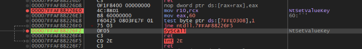

Looking at the side, the registers for the call are displayed as follows:
```
1: rcx 0000000000000470 0000000000000470
2: rdx 00000023552FE550 00000023552FE550
3: r8 0000000000000000 0000000000000000
4: r9 0000000000000004 0000000000000004
5: [rsp+28] 00000023552FE640 00000023552FE640
6: [rsp+30] 0000000000000004 0000000000000004
```
Checking https://ntdoc.m417z.com/ntsetvaluekey they should correspond to the following values:
```
rcx      --> HANDLE KeyHandle
rdx      --> PCUNICODE_STRING ValueName
r8       --> ULONG TitleIndex
r9       --> ULONG Type
[rsp+28] --> PVOID Data
[rsp+30] --> ULONG DataSize
```
The main things that matter here are rdx, which has a pointer to the value entry string (whatever the malware is trying to change) as well as [rsp+28] which corresponds to a pointer to the data for the value entry that is being set by the malware.
[rsp+30] being 4 is also an indicator that this is a DWORD value in the registry (4 bytes)

The only thing left at this point is finding out the actual value entry and value data. To do this I just typed "dump" followed by `00000023552FE550` for the value entry string and `00000023552FE640` for the value data.

Interestingly, the registry entry seemed to be a bit below the address. This was likely due to `PCUNICODE_STRING` holding other information as well.

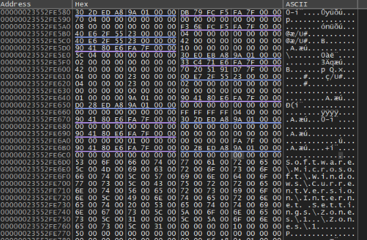

The registry entry string appeared to be `\Software\Microsoft\Windows\CurrentVersion\Internet Settings\Zones`

dumping the other value, the hex showed `01 00 00 00` which would correspond with `1` in little endian. Putting it all together, what this means is that theyre modifying 1, corresponding to the Intranet Zone. This makes perfect sense, because we saw the Intranet registry keys being tampered with earlier to relax browser and internet security policy.

Doing the same analysis on another time the breakpoint is hit, it appears `Software\Policies\Microsoft\Windows\CurrentVersion\Internet Settings\Lockdown_Zones` is also modified by the malware.

This further confirms the behavior of the malware modifying registry keys to weaken internet security policy.

## Eradication and Recovery
After finishing my analysis, I was still unable to find any more files being dropped or any C2 connection besides the GET requests I detailed earlier. This could be due to anti-debugging features or the campaign being over.

The main steps for recovery would be to simply delete the malware file (there might be persistence at later stages, I wasn't able to find it)

If you have network logs, check for any communication with steamcommunity pages and telegram pages, as those are the primary methods used by the malware to communicate.

Additionally, since the malware looks for browser cookies and extensions, you should assume a full compromise of browser data. In this case, change all browser related passwords, and fully uninstall and reinstall any browsers you have had, as well as making sure to delete/revoke all cookies.

Lastly, while the malware I analyzed didn't appear to drop new files, it changed multiple registry keys to weaken security policy, mainly to make exfiltrating browser data and communicating with the C2 easier. Some of these keys include:

```
HKCU\Software\Microsoft\Windows\CurrentVersion\Internet Settings\ZoneMap\ProxyBypass
HKCU\Software\Microsoft\Windows\CurrentVersion\Internet Settings\ZoneMap\IntranetName
HKCU\Software\Microsoft\Windows\CurrentVersion\Internet Settings\ZoneMap\UNCAsIntranet
HKCU\Software\Microsoft\Windows\CurrentVersion\Internet Settings\ZoneMap\AutoDetect
HKLM\Software\Microsoft\Windows\CurrentVersion\Internet Settings\Zones
HKLM\Software\Policies\Microsoft\Windows\CurrentVersion\Internet Settings\Lockdown_Zones
```

I would highly recommend auditing these keys and make sure that your Internet Setting registry keys / GPO is set to the correct state for your use case. There's no "correct" settings unfortunately since it depends on business context and some enterprises may choose to configure things like `ZoneMap\AutoDetect` differently.

With all of this being said, I wouldn't actually recommend trying to manually eradicate this malware, as there are a host of risks involved depending on if you miss something when removing it. The malware also likely has many different builds, as most infostealer families are sold as MaaS (malware-as-a-service) and often have different features like persistence methods, execution methods, delivery methods, etc, so these steps apply more to this specific sample than all Vidar samples as a whole.

For proper recovery, I would recommend changing all affected passwords (particularly anything you may have saved in your browser) as well as a full clean install of the operating system. If this isn't possible, using an antivirus like MalwareBytes is the next best option for removal.

## Future Work
As I said in the intro, this is a *very* incomplete analysis and a lot more could be done to uncover the wallet stealing routines, process hollowing that allegedly gets used (but I never observed, maybe due to anti-debug), and browser cookie exfiltration that the malware hinted at.

Perhaps I will write a script to xor decrypt all of the indirect API calls.

Anyways... hope you enjoyed 🤠

If you're reading this, sign my [guestbook](https://users3.smartgb.com/g/g.php?a=s&i=g36-41002-da)!